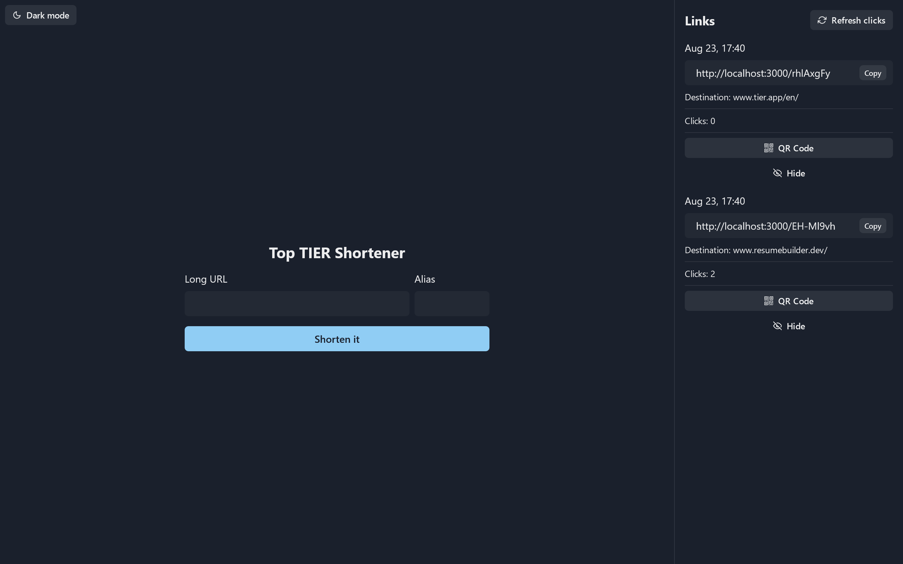

<div align="center">

[](https://cypress.io)
[](https://github.com/prettier/prettier)
[](https://github.com/malcodeman/url-shortener/blob/main/LICENSE)

</div>
<br />
<div align="center"><strong>ttier</strong></div>
<div align="center">Top tier url shortener.</div>
<br />
<div align="center">
  <sub>Coded by <a href="https://malcodeman.com">malcodeman</a> 👨‍🚀</sub>
</div>
<br />



## Getting started

```
git clone https://github.com/malcodeman/url-shortener.git
cd url-shortener
yarn install
yarn dev
```

## Environment variables

[Prisma](https://www.prisma.io/docs/reference/database-reference/connection-urls#env) needs a connection URL to be able to connect to your database.

## Testing

```
"cypress:open": "cypress open",
"cypress:run": "cypress run"
```

## License

[MIT](./LICENSE)
